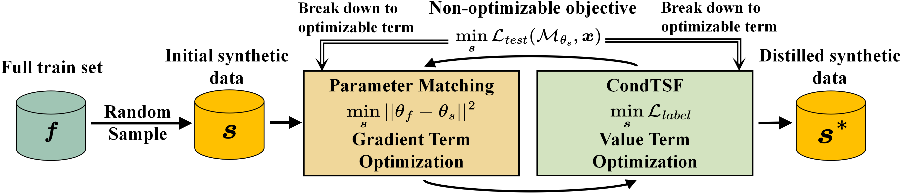

## CondTSF: One-line Plugin of Dataset Condensation for Time Series Forecasting



This is the code for NeurIPS 2024 "CondTSF: One-line Plugin of Dataset Condensation for Time Series Forecasting".

### Data

We upload the dataset to DropBox, use this [link](https://www.dropbox.com/scl/fo/i9ppyeruylg71hxjldamq/AAPfNEoNkqE6W6wQErx9hRI?rlkey=f3y6yezcvs6yst4tqag3yyjir&st=wlwwaubb&dl=0) to download the data.

After you download the dataset, put ```./data``` folder under this directory.

### Parameter Buffer

To obtain parameter $\{(\theta_0,\theta_f)\}^k$ that is used in dataset condensation, run the following command.
```bash
python buffer.py --dataset $dataset --FTD $ftd
# $ftd=0 means not using FTD
# $ftd=1 means using FTD
```
The results are stored in ```./buffers/$dataset/DLinear``` and ```./buffers/$dataset/DLinear_FTD```.

### Dataset Condensation & Single-architecture Evaluation

Run the following command to perform dataset condensation.
```bash
python distill.py --dataset $dataset --beta $beta --cond_gap $cond_gap --condensing_ratio $ratio --Iteration $iter --framework $backbone
# $beta is the additive ratio used in CondTSF, which has a range of (0, 1)
# $cond_gap is the gap of iterations using CondTSF, if $cond_gap > $iter, then CondTSF is not used
# $ratio is the condensing ratio, which can be chosen from [oneshot, standard, 3-standard], the explanation is in the paper
# $backbone is the backbone of CondTSF, it can be chosen from [DC, MTT, PP, TESLA, FTD, DATM, DM, IDM, KIP, FRePo]
```
The results are stored in ```./logged_files/$backbone``` if CondTSF is used, otherwise in ```./logged_files_baseline/$backbone```.

Single-architecture evaluation is conducted through dataset condensation. We use DLinear to perfrom dataset condensation and test the synthetic data on DLinear models. The MAE and MSE are reported in the log files.

### Cross-architecture Evaluation

Run the following command to perform cross-architecture evaluation of the synthetic data. The evaluation uses synthetic data from ```./logged_files/$backbone``` and ```./logged_files_baseline/$backbone```.
```bash
python cross_test.py --dataset $dataset --model $model --framework $backbone
# $model is the architecture that is tested, which can be chosen from [MLP, CNN, LSTM]
# $backbone is the dataset condensation method you would like to test.
# It can be chosen from [Random, CondTSF, DC, MTT, PP, TESLA, FTD, DATM, KIP, FRePo].
# if CondTSF is applied, then it will evaluate MTT+CondTSF.
```
The results are stored in ```./log_cross_test/$backbone/$dataset/$model```.